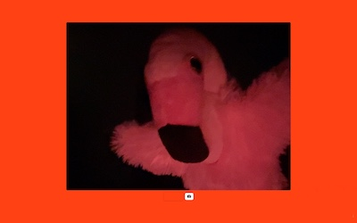
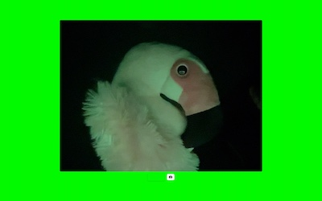
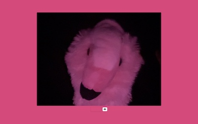
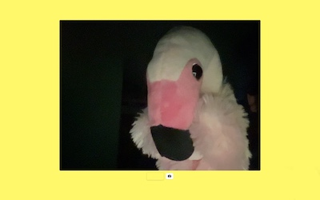
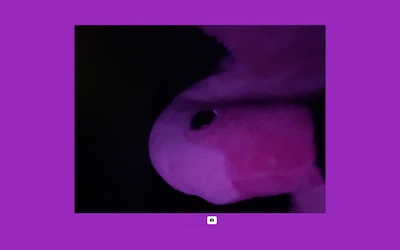

# Gumdrop

<table>
  <tr>
    <td></td>
    <td></td>
    <td></td>
  </tr>
  <tr>
    <td></td>
    <td></td>
    <td></td>
  </tr>
</table>

Gumdrop is a Mac app for having silly fun with my big screen and my webcam.

You run it in full screen, and it shows my webcam image on the back of a solid colour screen.
In a dark room and with a bright screen, it can really affect the vibe of the space!

This code is **extremely rough** and mostly for me to have fun with.

The interesting parts come from other people:

*   [Creating a webcam utility app for macOS in SwiftUI](https://benoitpasquier.com/webcam-utility-app-macos-swiftui/) by Benoit Pasquier
*   [SwiftUI for Mac Extras](https://troz.net/post/2020/swiftui_for-mac-extras/) by Sarah Reichelt
