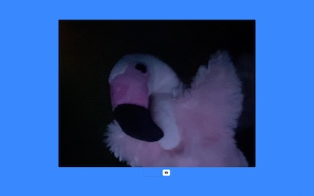

# Gumdrop

<table>
  <tr>
    <td></td>
    <td></td>
    <td></td>
  </tr>
  <tr>
    <td></td>
    <td></td>
    <td></td>
  </tr>
</table>

Gumdrop is a Mac app for having silly fun with my big screen and my webcam.

You run it in full screen, and it shows my webcam image on the back of a solid colour screen.
In a dark room and with a bright screen, it can really affect the vibe of the space!